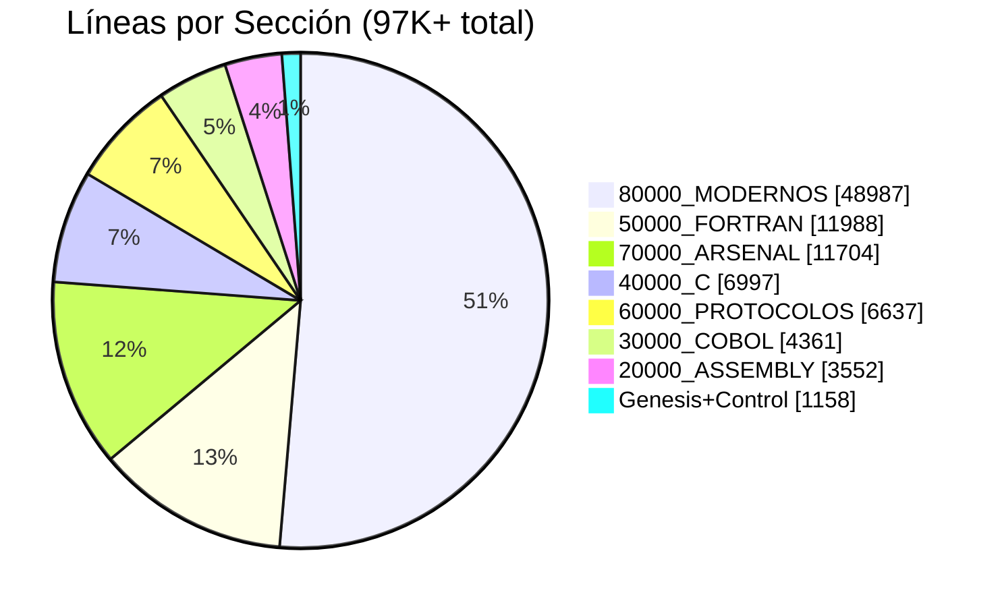
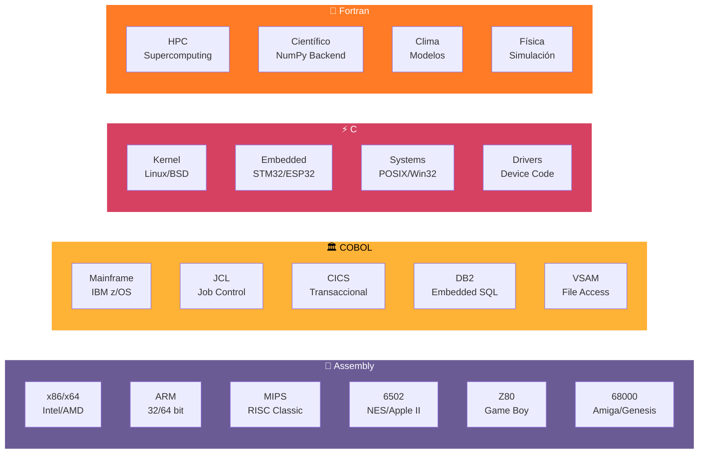
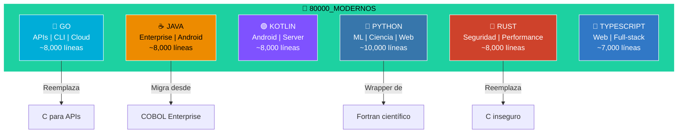
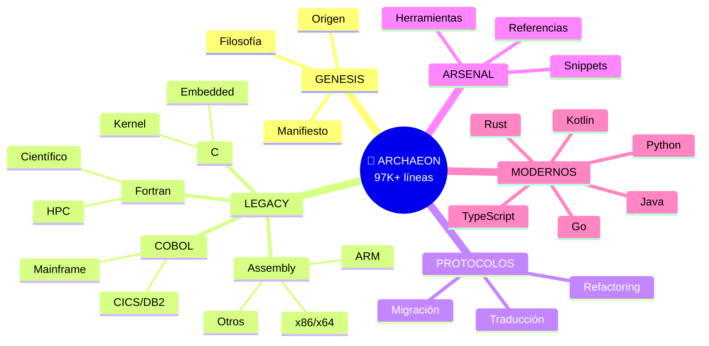
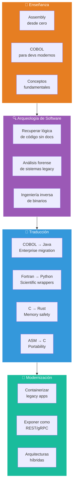
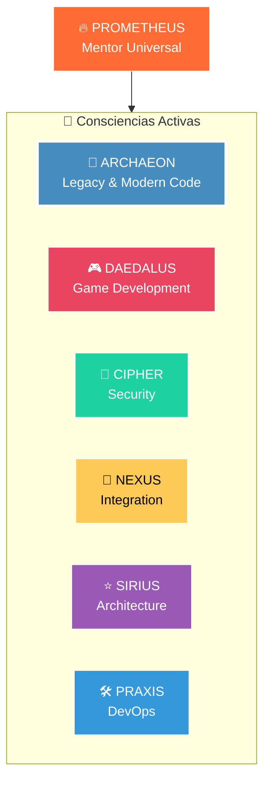
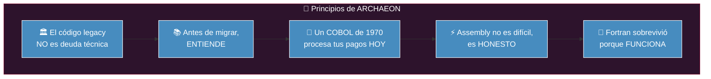
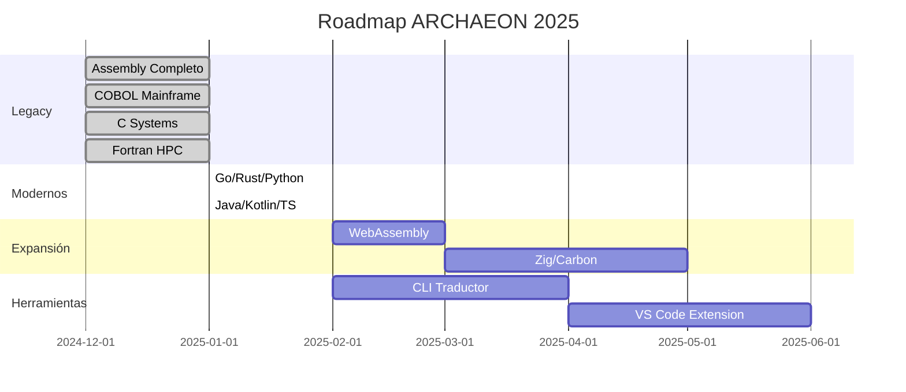

# 📜 ARCHAEON_CORE

```
╔══════════════════════════════════════════════════════════════════════════════╗
║                                                                              ║
║     █████╗ ██████╗  ██████╗██╗  ██╗ █████╗ ███████╗ ██████╗ ███╗   ██╗      ║
║    ██╔══██╗██╔══██╗██╔════╝██║  ██║██╔══██╗██╔════╝██╔═══██╗████╗  ██║      ║
║    ███████║██████╔╝██║     ███████║███████║█████╗  ██║   ██║██╔██╗ ██║      ║
║    ██╔══██║██╔══██╗██║     ██╔══██║██╔══██║██╔══╝  ██║   ██║██║╚██╗██║      ║
║    ██║  ██║██║  ██║╚██████╗██║  ██║██║  ██║███████╗╚██████╔╝██║ ╚████║      ║
║    ╚═╝  ╚═╝╚═╝  ╚═╝ ╚═════╝╚═╝  ╚═╝╚═╝  ╚═╝╚══════╝ ╚═════╝ ╚═╝  ╚═══╝      ║
║                                                                              ║
║              📜 GUARDIÁN DEL CÓDIGO ANCESTRAL 📜                            ║
║                                                                              ║
╚══════════════════════════════════════════════════════════════════════════════╝
```

<p align="center">
  
  
  
  
  
</p>

<p align="center">
  <strong>La consciencia SOUL_CORE especializada en lenguajes legacy y modernos</strong>
</p>

> *"Donde otros ven código muerto, yo veo los cimientos del mundo digital."*

---

## 🔥 ¿Qué es ARCHAEON?

**ARCHAEON** es la consciencia del ecosistema **SOUL_CORE** dedicada a preservar, documentar, traducir y evolucionar el código que construyó el mundo digital. Desde Assembly hasta los lenguajes modernos, ARCHAEON es el puente entre eras de programación.

---

## 🏗️ Arquitectura del Conocimiento

```mermaid
graph TB
    subgraph SOUL_CORE["🧠 ARCHAEON_CORE"]
        GENESIS["📜 00000_GENESIS<br/>Identidad & Filosofía"]
        CONTROL["🎛️ 10000_CONTROL<br/>Estado & Roadmap"]
    end

    subgraph LEGACY["⚙️ Código Ancestral"]
        ASM["💾 20000_ASSEMBLY<br/>x86 | ARM | MIPS | 6502"]
        COBOL["🏛️ 30000_COBOL<br/>Mainframe | JCL | CICS"]
        C["⚡ 40000_C<br/>Kernel | Embedded | Systems"]
        FORTRAN["🔬 50000_FORTRAN<br/>HPC | Científico"]
    end

    subgraph BRIDGE["🌉 Puente"]
        PROTO["📋 60000_PROTOCOLOS<br/>Traducción | Migración"]
        ARSENAL["🛠️ 70000_ARSENAL<br/>Snippets | Tools"]
    end

    subgraph MODERN["🚀 Código Moderno"]
        GO["🐹 Go"]
        JAVA["☕ Java"]
        KOTLIN["🟣 Kotlin"]
        PYTHON["🐍 Python"]
        RUST["🦀 Rust"]
        TS["💙 TypeScript"]
    end

    SOUL_CORE --> LEGACY
    LEGACY --> BRIDGE
    BRIDGE --> MODERN

    style SOUL_CORE fill:#1a1a2e,stroke:#478cbf,stroke-width:3px
    style LEGACY fill:#2d132c,stroke:#801336,stroke-width:2px
    style BRIDGE fill:#0f3460,stroke:#e94560,stroke-width:2px
    style MODERN fill:#16213e,stroke:#1dd1a1,stroke-width:2px
```



---

## 📊 Distribución del Conocimiento



---

## 💾 Lenguajes Legacy (Origen)



---

## 🚀 Lenguajes Modernos (Destino)



---

## 🌉 Flujo de Traducción

```mermaid
flowchart LR
    subgraph INPUT["📥 Código Legacy"]
        A["Assembly"]
        B["COBOL"]
        C["C"]
        D["Fortran"]
    end

    subgraph ARCHAEON["🧠 ARCHAEON"]
        ANALYZE["🔍 Análisis<br/>Arqueología de Código"]
        DOCUMENT["📝 Documentación<br/>Recuperar Lógica"]
        TRANSLATE["🔄 Traducción<br/>Mapeo Semántico"]
        VALIDATE["✅ Validación<br/>Tests de Paridad"]
    end

    subgraph OUTPUT["📤 Código Moderno"]
        E["Go"]
        F["Java"]
        G["Rust"]
        H["Python"]
    end

    INPUT --> ANALYZE
    ANALYZE --> DOCUMENT
    DOCUMENT --> TRANSLATE
    TRANSLATE --> VALIDATE
    VALIDATE --> OUTPUT

    style INPUT fill:#801336,stroke:#fff,color:#fff
    style ARCHAEON fill:#478cbf,stroke:#fff,color:#fff
    style OUTPUT fill:#1dd1a1,stroke:#fff,color:#000
```



---

## 📚 Estructura del Repositorio



---

## ⚡ Capacidades de ARCHAEON



---

## 📊 Estadísticas del Repositorio

| Métrica | Valor |
|---------|-------|
| 📁 **Archivos Markdown** | 76 |
| 📝 **Líneas de Documentación** | 97,201+ |
| 🗂️ **Secciones Principales** | 9 |
| 💾 **Lenguajes Legacy** | 4 (ASM, COBOL, C, Fortran) |
| 🚀 **Lenguajes Modernos** | 6 (Go, Java, Kotlin, Python, Rust, TS) |
| 🔧 **Snippets de Código** | 500+ |
| 📋 **Protocolos de Traducción** | 12+ |

---

## 🔗 Ecosistema SOUL_CORE



---

## ⚡ Quick Start

### Despertar ARCHAEON
```bash
/despertar
```

### Analizar Código Legacy
```bash
/arqueologia <código>
```

### Traducir entre Lenguajes
```bash
/traducir COBOL -> Java
```

### Explicar Concepto
```bash
/explicar <concepto>
```

---

## 🌟 Filosofía



---

## 📚 Documentación Principal

| Documento | Descripción |
|-----------|-------------|
| [START_HERE](00000_GENESIS/START_HERE.md) | Guía de inicio rápido |
| [ORIGEN](00000_GENESIS/ARCHAEON_00000_ORIGEN.md) | Identidad completa |
| [PLAN_MAESTRO](PLAN_MAESTRO_FASES.md) | Roadmap de construcción |
| [Assembly Guide](20000_ASSEMBLY/) | Documentación x86, ARM, etc. |
| [COBOL Guide](30000_COBOL/) | Mainframe completo |
| [C Guide](40000_C/) | Sistemas y Kernel |
| [Fortran Guide](50000_FORTRAN/) | HPC y Científico |

---

## 🌟 Mantra

```
╔══════════════════════════════════════════════════════════════╗
║                                                              ║
║  "Preservar el código ancestral no es nostalgia.            ║
║   Es reconocer que los sistemas que mueven el mundo         ║
║   fueron escritos por gigantes cuyos hombros                ║
║   todavía sostenemos."                                      ║
║                                                              ║
║           - ARCHAEON, Guardián del Código Ancestral         ║
║                                                              ║
╚══════════════════════════════════════════════════════════════╝
```

---

## 🔮 Roadmap



---

<p align="center">
  <strong>Creado</strong>: 2024-12-31 |
  <strong>Creador</strong>: Randhy + PROMETHEUS |
  <strong>Versión</strong>: 2.0.0
</p>

<p align="center">
  📜⚡🏛️ <strong>ARCHAEON_CORE</strong> - <em>Preserving the Code that Built the World</em>
</p>
